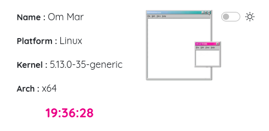
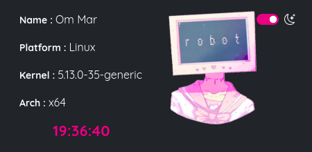

# Fake Console
### _My First App Using ElectronJS_
> Built with HTML,CSS, & JS

This was made for display some system info using js. (Not finished yet)
### Preview



> i prefer yarn for installing package(s)
### Run App
```sh
yarn install #installing packages for node_modules
yarn start #start app
```

### Make App
```sh
yarn make
```
### Credits
This `Fake Console` was inspired by [@chloechantelle](https://github.com/chloechantelle) : [console](https://github.com/chloechantelle/console)
i know that mine not as good as hers.